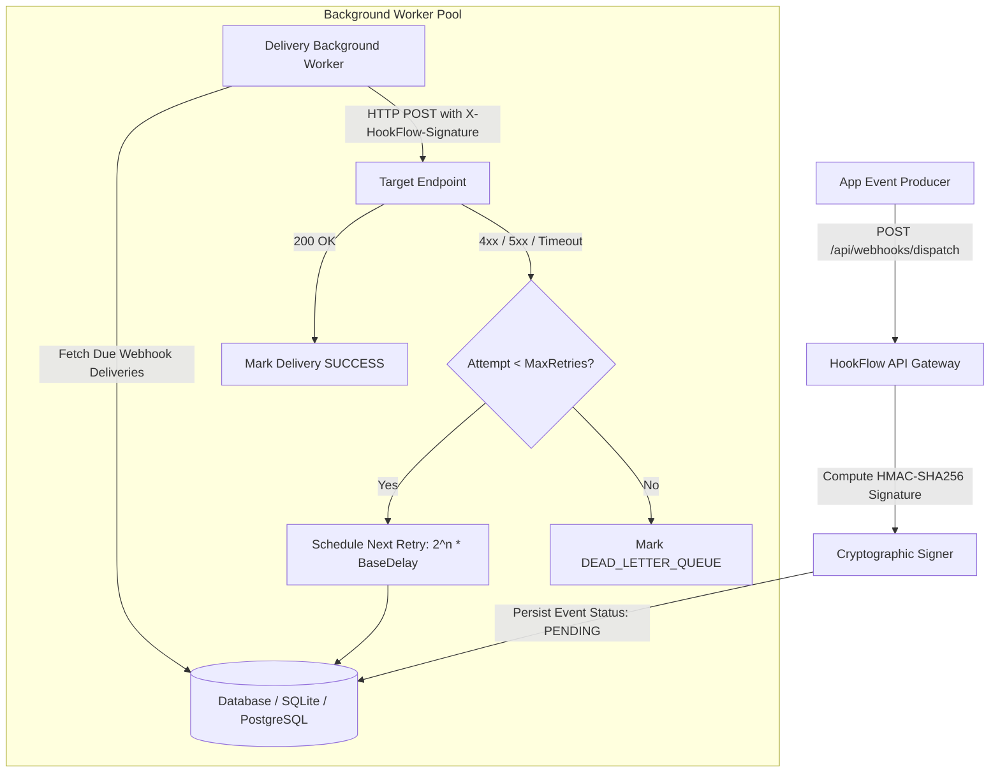

# HookFlow

> High-throughput, resilient webhook delivery engine with **exponential backoff**, **HMAC-SHA256 signature verification**, dead-letter queue management, and asynchronous background workers built in **C# / .NET 8**.

[](https://dotnet.microsoft.com)
[](https://docs.microsoft.com/en-us/dotnet/csharp/)
[](https://github.com/txltedxgod/hookflow/actions)
[](LICENSE)

`#dotnet` `#csharp` `#webhooks` `#event-driven` `#background-service` `#resilience` `#microservices`

---

## 🏛️ Event Ingestion & Delivery Flow



---

## Features

- **Reliable At-Least-Once Delivery:** Decoupled event ingestion from HTTP delivery via persistent queueing.
- **HMAC-SHA256 Payload Signing:** Secures payloads with standard `X-HookFlow-Signature` verification headers.
- **Jittered Exponential Backoff:** Automatic retries for transient HTTP errors (5xx, 429, socket timeouts).
- **Dead-Letter Queue (DLQ):** Failed events after maximum attempts are routed to DLQ for manual inspection and replay.
- **Unit & Integration Tested:** xUnit test suite covering delivery retry math and signature computation.

## Quick Start

```bash
# Clone & run via .NET CLI
dotnet run --project src/HookFlow.Api

# Run tests
dotnet test
```
